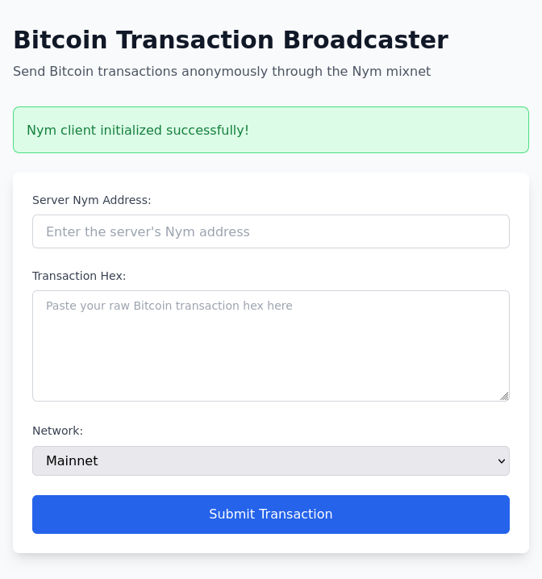

# Broadnym - Bitcoin Transaction Broadcaster



Broadnym is a privacy-preserving Bitcoin transaction broadcaster that uses the Nym mixnet to anonymize transaction submissions. It consists of a server component that receives transactions through the Nym network and forwards them to Bitcoin's mempool, and a web UI for submitting transactions.

## Dev Shell
The project contains a Nix dev shell with all required dependencies, you can enter it by running:

```bash
nix develop
```

## Running the Application

### Option 1: Run both server and UI together (recommended)

```bash
just dev
```

This will start both the server and the UI development server concurrently. The server will run on port 3000 by default, and the UI will be available at http://localhost:8080.

### Option 2: Run components separately

#### Start the server

```bash
cargo run --package broadnym_server
```

Or with a custom port:

```bash
cargo run --package broadnym_server -- --port 8000
```

#### Start the UI development server

In a separate terminal:

```bash
cd client
trunk serve
```

The UI will be available at http://localhost:8080

## Building for Production

### Build the server

```bash
cargo build --package broadnym_server --release
```

The binary will be available at `target/release/broadnym_server`

### Build the client

```bash
cd client
trunk build --release
```

The built files will be in `client/dist/`

## Usage

1. Start the server - it will connect to the Nym mixnet and display its Nym address on port 3000 (or the port you specified)
2. Open the UI in your browser
3. Enter the server's Nym address in the UI
4. Paste your raw Bitcoin transaction hex
5. Select the network (Mainnet, Testnet, or Signet)
6. Click "Submit Transaction"

The transaction will be sent anonymously through the Nym mixnet to the server, which will then broadcast it to the Bitcoin network.

## Development

- Run `just clippy` to run linting
- Run `just fmt` to format code
- Run `just test` to run tests
- Run `just check` to check all packages

## Architecture

- **Server** (`server/`): Axum-based web server that connects to Nym mixnet and forwards transactions to Bitcoin's mempool
- **Client** (`client/`): Leptos-based WebAssembly UI for submitting transactions
- **Common** (`common/`): Shared types and utilities between server and client